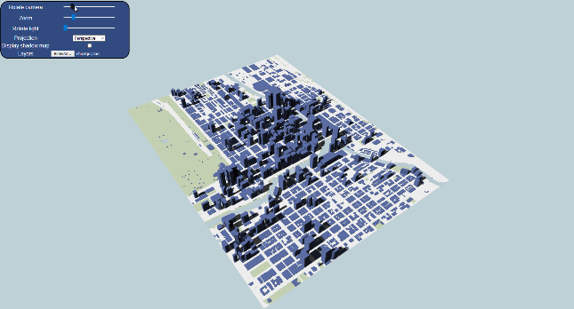
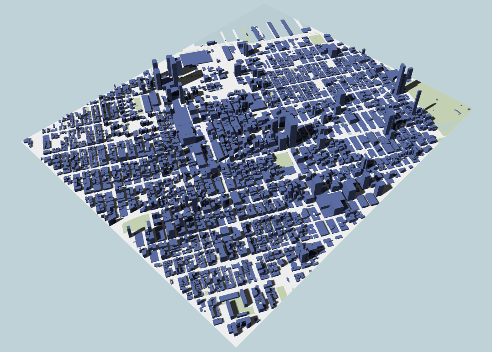
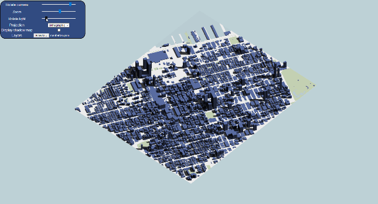

# CS425 - Computer Graphics I (Spring 2022)

## Assignment 2: Shadow maps
The goal of this assignment is to implement the shadow mapping technique using WebGL. Also considering what we have learned in assignment 1, you will develop an application to render shadows (directional light) on an urban setting described in an external JSON file (uploaded by the user through a configuration panel). The JSON file has four layers describing the elements and color of buildings, parks, water and surface of a particular region (see below for a complete description of the file). Just like assignment 1, you should use a unique buffer and VAO for *each* layer.

There are five tasks, and you are free to use the skeleton code provided. The code has some comments detailing what needs to be implemented in each function; it contains functions to handle file upload, and user interactions through the control panel, as well as four main classes:
- `FBO`: handles the creation and binding of [framebuffer objects](https://developer.mozilla.org/en-US/docs/Web/API/WebGLFramebuffer).
- `ShadowMapProgram`: handles the shadow map computation, including light space transformations.
- `RenderToScreenProgram`: handles the rendering of a 2D texture to the screen.
- `LayerProgram`: class to handle shading of both flat layers (water, parks, surface), as well as the building layer. Similarly to assignment 1, you should use the normals to shade the side of the buildings. This time, however, you must make sure that the light direction is the same as the one used for the computation of the shadow map.
- `Layer`: class to handle both flat layers, and building layer.
- `Layers`: collection of layers.

File `utils.js` contains some useful functions to create [fbos](https://developer.mozilla.org/en-US/docs/Web/API/WebGLFramebuffer), [shaders](https://developer.mozilla.org/en-US/docs/Web/API/WebGLShader), [programs](https://developer.mozilla.org/en-US/docs/Web/API/WebGLProgram), [buffers](https://developer.mozilla.org/en-US/docs/Web/API/WebGLBuffer), [VAOs](https://developer.mozilla.org/en-US/docs/Web/API/WebGLVertexArrayObject), as well as [matrix operations](https://developer.mozilla.org/en-US/docs/Web/API/WebGL_API/Matrix_math_for_the_web), [projections](http://www.songho.ca/opengl/gl_projectionmatrix.html), and [lookat](https://www.khronos.org/registry/OpenGL-Refpages/gl2.1/xhtml/gluLookAt.xml).

Here is an example of assignment 2:


### Tasks

#### Task 1
Create a configuration panel with the following components: 
1) A [dropdown](https://developer.mozilla.org/en-US/docs/Web/HTML/Element/option) menu with values *perspective* and *orthographic*. Changing the selected option should change the projection type (see Task 5).
2) A [checkbox input](https://developer.mozilla.org/en-US/docs/Web/HTML/Element/input/checkbox) element responsible for toggling the display of the shadow map texture.
3) A file [input](https://developer.mozilla.org/en-US/docs/Web/HTML/Element/input/file) element responsible for loading a JSON file (see Task 2).

#### Task 2
In order to handle layers, you should implement the `init` and `draw` functions in the `Layer` class. Two important notes: 1) there is only one layer class (for both flat surfaces and buildings); you should then handle this appropriately; 2) you should create both a `LayerProgram` as well as a `ShadowMapProgram`; and you should use one or the other depending if it is the first or second pass of the shadow map technique.

#### Task 3
You should implement the transformation matrices inside `updateViewMatrix`, `updateModelMatrix`, and `updateProjectionMatrix`, in such a way that when the usermoves the mouse around the canvas, the camera rotates around the centerpoint of the layers. This is similar to what was implemented in the first assignment. The initial position of the camera should be similar to the image below:



#### Task 4
You should implement the light transformation matrices inside `updateLightViewMatrix` and `updateLightProjectionMatrix`, in such a way that when the user changes the value of slider (3), the light direction rotates around the centerpoint of the layers. Make sure that you use the *same light direction for both shadow map and surface shading* (for layers that have normals). As seein in class, these matrices should be used in the *first* pass of the shadow map technique.

#### Task 5
In order to ensure that you have successfully implemented tasks 3 and 4, make sure that you can seperately render the city model from the perspective of the camera and the light. After that, you will need to store the result of task 4 in a texture (make use of a framebuffer object to do that). Modify your implementation of task 3 so that it uses this depth texture to compute the shadow information in the fragment shader. Here is an example of the result:



#### Task 6 (Optional)
You should implement the RenderToScreen class, so that it renders a texture to screen. If the input (5) is checked, you should display the result of the first pass of the shadow map computation (Task 4). 


#### Task 7 (Optional)
Instead of considering a single shadow map sample, consider multiple shadow map values in a small radius around the sample position (*percentage closer filtering*). The result of these shadow tests should be averaged, getting a smoother line between light and shadow.

#### JSON format

The JSON file contains coordinates, indices, and colors for 4 layers (buildings, water, parks, surface). The building layer also contains normals for each vertex. You can download a zip file containing a JSON with a region of [Manhattan](https://fmiranda.me/courses/cs425-spring-2021/manhattan.json.zip) or a region of [Chicago](https://fmiranda.me/courses/cs425-spring-2021/chicago.json.zip).

The `coordinates` array consists of a list of all the vertices for that particular layer. The `indices` array contains the indices of the vertices used to render triangles via `glDrawElements`. That is, starting from the first element in the indices array, every three values correspond to indices of vertices that make a triangle in the triangle mesh.

```javascript
{
    'buildings': 
    {
        'coordinates': [x_1,y_1,z_1,x_2,y_2,z_2,...,x_n,y_n,z_n],
        'indices': [i_1,i_2,...,i_n],
        'normals': [x_1,y_1,z_1,x_2,y_2,z_2,...,x_n,y_n,z_n],
        'color': [r,g,b,a]
    },
    'water': 
    {
        'coordinates': [x_1,y_1,z_1,x_2,y_2,z_2,...,x_n,y_n,z_n],
        'indices': [i_1,i_2,...,i_n],
        'color': [r,g,b,a]
    },
    'parks': 
    {
        'coordinates': [x_1,y_1,z_1,x_2,y_2,z_2,...,x_n,y_n,z_n],
        'indices': [i_1,i_2,...,i_n],
        'color': [r,g,b,a]
    },
    'surface':
    {
        'coordinates': [x_1,y_1,z_1,x_2,y_2,z_2,...,x_n,y_n,z_n],
        'indices': [i_1,i_2,...,i_n],
        'color': [r,g,b,a]
    },
}
```

### Submission
The delivery of the assignments will be done using GitHub Classes. It will not be necessary to use any external JavaScript library for your assignments. If you do find the need to use additional libraries, please send us an email or Discord message to get approval. Your assignment should contain at least the following files:
- index.html: the main HTML file.
- gl.js: assignment main source code.
- \*.vert.js: vertex shaders.
- \*.frag.js: fragment shaders.
- README.md and image files: markdown readme file with a description of your program.

### Grading
The code will be evaluated on Firefox. Your submission will be graded according to the quality of the image results, interactions, and correctness of the implemented algorithms.

To get a C on the assignment, your application should be able to load a JSON file in the format specified above, and visualize all layers using a perspective projection. To get a B on the assignment, you should implement the shadow map technique for a given light direction. To get a A, you must implement all user interactions. Tasks 6 and 7 are optional -- 5% each.

